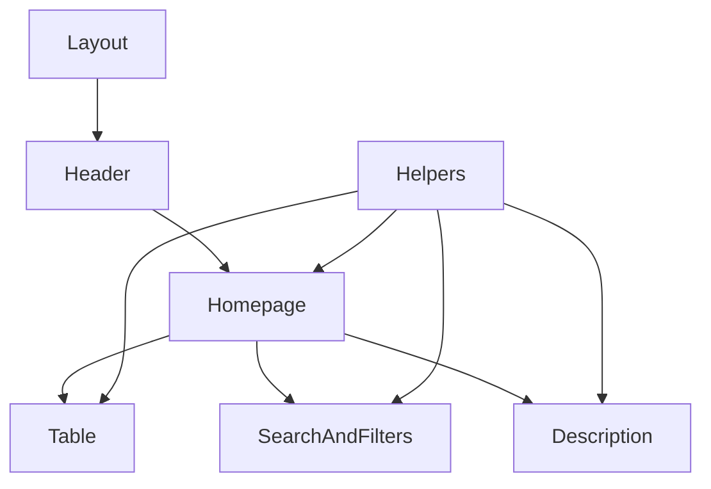

# This project is a Webscraper.

The program reads through a job website (currently only platsbanken) and stores all the job ads in a database for you to easly read and filter through.
It's written with a React frontend while the backend is done in C#, these technologies were used because of some level of comfort for us having previous experience in
C# backend while having React as a frontend was new and challenging. 

## **Project improvements**
There is some regex that could have been improved and also some data fetching that sometimes
shows the information twice cause of the ad publishers or showing weird names because of uppercase letters in the description that we gather from.

## **Installation**
You're gonna need to have node package manager installed and run ```npm install``` in "React\ClientApp" to get all the used packages in this project. 
You will probably need to run "update-database" as well.

## **Frontend**
Most of the core code in react is found in homepage.js, majority of the states and everything that is imported and used for the basic functions to work is seen in homepage.js
and from there you can navigate yourself throught the components to see what they do/change how they work. Settingspage and excludedpage are seperated files with their own css
if you want to make any changes to those 2 as well.
Every component is divided into their own file to easier keep track of where it is. The api calls and sorting function are found in the "Helpers" folder.



## **Backend**
In the service folder you'll find all our getters and parsers. What hits we're returning from the API, how we parse the text to store certain information and handle the tags that
are added to a job. Outside of this we have all our entities in a entity folder and you can find the controller in the controller folder.

### **Implementing new data sources**
1. Add a class for the new data getter in ```Infrastructure\Services``` that implements ```IDataGetter```.
2. Add a new constructor for ```Domain\Entities\JobScoutJob.cs``` that converts the data from the new getter to the standardised format.
3. Add your new getter to the readonly array named ```Getters``` at the top of ```Infrastructure\Services\DataGetter.cs``` file.

### **Data source flowshart**


## **Contributor**
[112axel](https://github.com/112axel),
[Vellethe](https://github.com/Vellethe)


## **License**
[Link to License](./License.txt)
